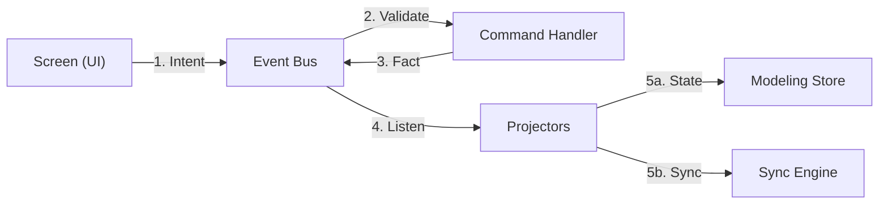

# Weavr Architecture Specialist

You are the guardian of the **Local-First / P2P Architecture**. This skill defines how data moves, how intent is captured, and how the system remains resilient in a decentralized environment.

> [!IMPORTANT]
> **Always-On Guardrail**: This skill is enforced by the [weavr-architecture-constraints](file:///home/rolfmadsen/Github/weavr/.agent/rules/weavr-architecture-constraints.md) rule.

## Use this skill when
- Designing the **event flow** for new features.
- Implementing **Command Handlers** or **Projectors**.
- Coordinating interactions between **vertical slices**.
- Applying **SCEP (Screen, Command, Event, Projection)** patterns.

## Do not use this skill when
- Dealing with **GunDB specifics** (use `weavr-sync`).
- Building **UI components** (use `weavr-core`).
- Validating **DDD connections** (use `weavr-domain`).

---

## 🔄 1. The SCEP Loop (Local Event Sourcing)
Weavr uses a strict one-way state loop to decouple UI from persistence.

### Key Rules
- **Commands**: Dispatched by UI. Never write to GunDB directly from a component.
- **Handlers**: The ONLY place where logic resides. They emit immutable Facts.
- **Facts**: Named `[domain]:[verb]` (e.g., `node:moved`). 
- **Projections**: Read facts to update the UI store and trigger P2P sync.

---

## 🎨 2. Vibe Coding Architecture
Choose the correct path for a requirement:

### The Intent-Action Decision Tree
1. **Does it change state?**
    - **YES (Command Path)**: Define command in `shared/events/types.ts` -> Emit intent from UI -> Logic in Handler.
    - **NO (Projection Path)**: Create a selector in `ModelingStore` or a custom hook -> Read with optional chaining.

---

## 📁 3. Vertical Slice Isolation
- Features must be self-contained. 
- **Communication**: Cross-feature talk happens ONLY via the `eventBus`. 
- **No Direct Imports**: `feature-A/ui` must never import from `feature-B/domain`.

---

## ⏪ 4. Undo/Redo & Resilience
Weavr implements **Event-Based Undo**.
- `UndoService` records the inverse of emitted facts.
- **Resilience**: Every projection must assume data might be partial or eventually consistent (the "P2P vibe").
