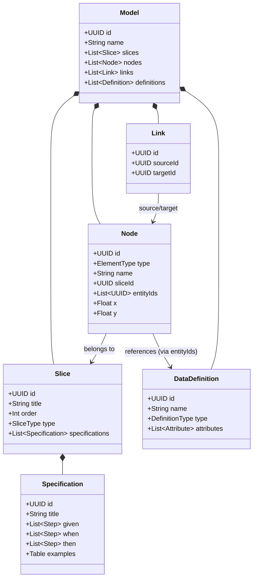

# Feature Specification: Central Data Model

**Status**: Implemented
**Last Updated**: 2025-12-07

## 1. Overview
This document serves as the **Single Source of Truth** for the application's data structure. It visualizes how the Core Event Model, Slices, and Data Definitions interact.

## 2. Entity Relationship Diagram (ERD)



## 3. Core Entities

### 3.1. Node (The Atom)
The fundamental building block.
*   **Purpose**: Represents a Step in the system (Command, Event, Screen).
*   **Key Relationships**:
    *   `sliceId`: The vertical "Swimlane" this node belongs to.
    *   `entityIds`: An array of `DataDefinition` IDs. This links the *visual* box to the *schema* (e.g., a "Register" Command node is linked to the "User" Entity definition).

### 3.2. Slice (The Container)
A vertical partition (Swimlane) representing a feature or user story.
*   **Purpose**: Grouping related nodes and verifying logic via Specifications.
*   **Key Relationships**:
    *   `specifications`: A list of BDD (Given/When/Then) scenarios that test the logic of this slice.

### 3.3. Link (The Flow)
A directed edge between two nodes.
*   **Purpose**: Shows information flow or causation.
*   **Reflexivity**: Links are stored separately from nodes to allow many-to-many relationships easily.

### 3.4. Data Definition (The Schema)
A reusable type definition (Entity, Value Object, Enum).
*   **Purpose**: To define the *structure* of data flowing through Nodes.
*   **Reusability**: One "User" definition can be referenced by the "Register" Command, the "UserRegistered" Event, and the "UserProfile" Read Model.

## 4. Persistance (GunDB)
The data is stored as a graph in GunDB, but conceptually it follows a hierarchical document structure:

```
root
 ├── nodes/
 │    └── {nodeId} -> { ...nodeData }
 ├── links/
 │    └── {linkId} -> { source, target... }
 ├── slices/
 │    └── {sliceId} -> { title, order... }
 └── definitions/
      └── {defId}   -> { name, attributes... }
```

## 5. Cross-Cutting Concerns
*   **Ordering**: Slices are ordered by an explicit `order` index. Nodes are effectively unordered (spatial `x,y`).
*   **Ownership**: A Node can only belong to **one** Slice.
*   **Multi-Reference**: A Node can reference **multiple** Definitions (e.g., a "Checkout" command might reference "Cart" and "Payment" entities).
